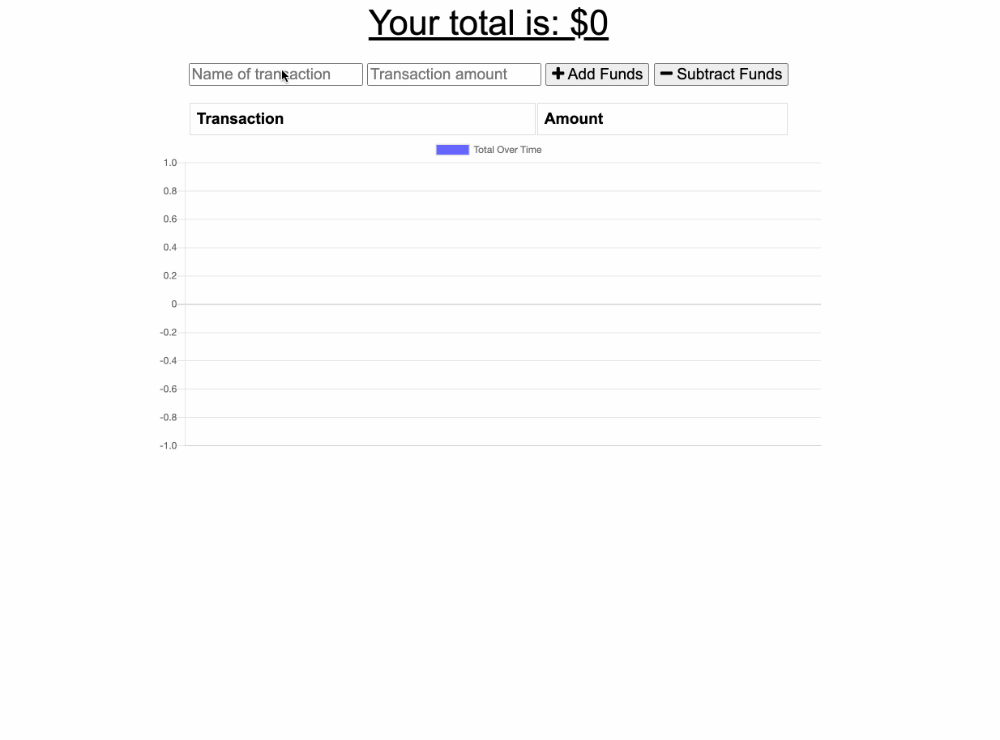

# progressive-budget-tracker

This app was built as practice for using service workers and manifest files. In the app users can input a transaction and amount and add or subtract that ammount from the total. It is displayed using a chart.js chart.

## Questions
celparros@gmail.com

[Link To Heroku Deployed App](https://desolate-scrubland-39557.herokuapp.com/)

